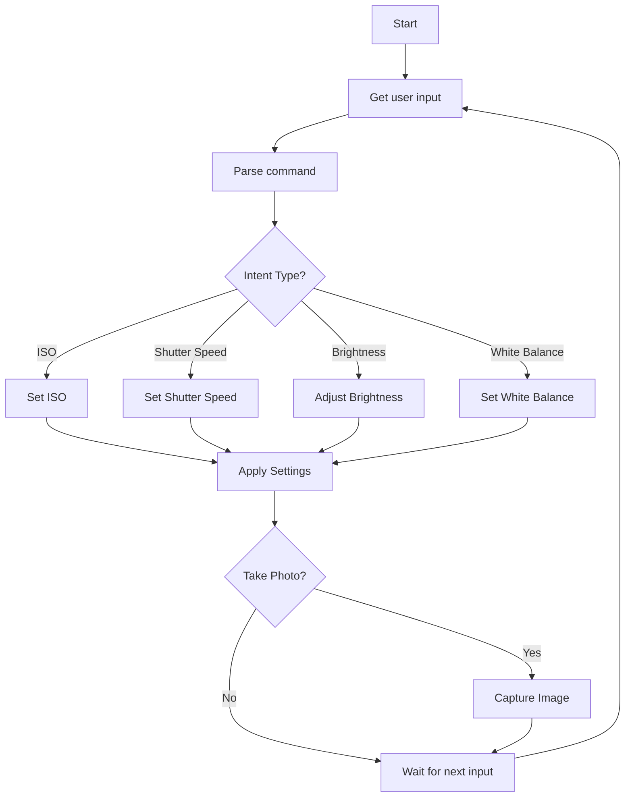

# [Prototype](https://www.figma.com/proto/Zf6ucyS94JkTrmuoybwpVR/Samsung-Camera-App-Feature?node-id=3-3&t=UfFNdaGySeUU5b3j-0&scaling=scale-down&content-scaling=fixed&starting-point-node-id=3%3A3)

# Table of Contents

1. Prototype
2. Feature introduction: Case-based Camera Pro Settings
3. Underlying technologies
4. Research leveraged
5. Implementation steps
6. **Flowchart**
7. Pseudocode and logic
8. Data structures
9. Functions
10. Main program
11. Camera API considerations
12. Future improvements
13. View design
14. License

## Feature Introduction: Case-based Camera Pro Settings

### Problem Statement
Modern smartphones have powerful manual camera capabilities, but most users find manual settings (ISO, aperture, shutter speed, exposure, focus, white balance, etc.) confusing or overwhelming. There's currently no intuitive solution enabling average users to access professional-level photographic adjustments without extensive knowledge or trial-and-error.

### Introducing: Case-based Camera Pro Settings

**Concept Overview:**  
The Case-based Camera Pro Settings feature enables users to intuitively achieve optimal photographic results simply by expressing natural-language intentions or preferences. Users don't need detailed technical understanding; they describe their desired photographic outcomes verbally, and the camera software dynamically interprets these requests into optimal manual settings.

**Example Scenario:**  
A user preparing to photograph a sunset scene could simply say:
- *"Make the stars pop out more,"*
- *"Focus more on the background,"*
- *"Capture the sun's bright light without distorting nearby objects,"*
- *"Focus on the left corner where the person is standing."*  
The phone instantly translates these natural language descriptions into precise adjustments of ISO, white balance, shutter speed, aperture, exposure, and focus depth.

### Problem Statement Being Solved:

- Users struggle with complex manual camera controls.
- There's a gap between novice photography enthusiasts and professional camera settings.
- Existing auto modes lack nuanced, context-aware fine-tuning based on user intent.

### Use Cases:

1. **Casual Users:** Quick optimization for everyday photography situations (portraits, landscapes, low-light).
2. **Content Creators:** Efficiently translate creative visions into professional photos without manual fine-tuning.
3. **Professional Photographers:** Faster workflow by initial automated setting adjustments, with manual tweaks thereafter.

### Functional Description:

- Users activate the feature via voice command or simple UI prompt.
- Natural language input is processed by an on-device AI model.
- The AI translates descriptive inputs into precise camera parameter adjustments in real-time.
- A live preview instantly shows the applied adjustments, allowing users to iteratively refine commands.

### Underlying Technologies:

- **On-Device Natural Language Processing (NLP):**
  - Google's Gemini AI or Samsung's in-house NLP model interpreting context and photographic intent from spoken or typed language.

- **AI-driven Computational Photography Algorithms:**
  - Leveraging Samsung's advanced computational photography (ISP integration, Exynos or Snapdragon NPUs) for real-time, AI-based adjustments.

- **Scene Understanding via Computer Vision:**
  - Object detection and semantic segmentation to interpret spatial commands ("left corner," "background").
  - HDR and multi-frame image fusion for handling dynamic lighting instructions ("sun's bright light").

- **Adaptive Image Processing Pipeline:**
  - Dynamically adjusts ISO, exposure, white balance, depth-of-field, and focus based on AI-determined optimal parameters.

- **Integration with Samsung's Exynos/Snapdragon Chips:**
  - Exploiting the latest NPUs and ISPs for efficient on-device computation and minimal latency.

### Research Leveraged:

- Samsung’s AI photography features (Nightography, Object Eraser).
- Google's generative AI camera editing (Magic Editor, Best Take).
- Semantic segmentation and computational photography research from industry leaders like Google Research.

### Implementation Steps:

1. **Research and Prototyping:**
   - Build a prototype NLP model trained on a dataset of photographic commands and desired outcomes.

2. **Integration with Camera OS Pipeline:**
   - Modify camera OS-level software to process NLP outputs directly into manual setting adjustments.

2. **User Testing and Refinement:**
   - Iterate prototypes through UX testing with diverse user feedback.

3. **Deployment:**
   - Integrate into Samsung’s camera OS (One UI Camera) across Galaxy smartphones, watches (basic settings via voice commands), and future XR devices for immersive photographic control.

This feature empowers Samsung device users—regardless of expertise level—to effortlessly achieve professional-quality photography through intuitive interactions.

### Flowchart

Below is a flowchart representing the camera control logic.

### Pseudocode and Logic

Function: AdjustCameraSettings(user_command)

1. NLP Processing
	-	Parse user_command to extract:
	-	Intent (e.g., "take a bright photo", "use long exposure")
	-	Parameters (e.g., "ISO 800", "shutter speed 1/30")

2. Camera Control
	-	If intent = "set ISO" → Set camera ISO
	-	If intent = "set shutter speed" → Set shutter speed
	-	If intent = "take a bright photo" → Adjust ISO/shutter speed
	-	If intent = "use long exposure" → Set shutter speed for long exposure

3. Capture Image
	-	Apply camera settings and take a photo if requested.

### Data Structures

#### Command structure to hold parsed command information
~~~
class Command:
    def __init__(self, intent, parameters):
        self.intent = intent  # String (e.g., "ISO", "shutter", "brightness")
        self.parameters = parameters  # Dictionary (e.g., {"value": "800", "unit": "ISO"})
~~~

#### Camera settings structure
~~~
class CameraSettings:
    def __init__(self, ISO=100, shutterSpeed="1/60", aperture=2.8, whiteBalance="auto"):
        self.ISO = ISO  # Integer
        self.shutterSpeed = shutterSpeed  # String (e.g., "1/60", "2s")
        self.aperture = aperture  # Float (if applicable)
        self.whiteBalance = whiteBalance  # String (e.g., "auto", "daylight")
~~~

### Functions ParseCommand(userInput) -> Command
1.	Use an NLP library (e.g., spaCy, Hugging Face) to:
	-	Tokenize userInput
	-	Perform Part-of-Speech tagging
	-	Identify intent based on keywords and structure
	- Extract relevant parameters
2.	Return a Command object.
 
~~~
def ParseCommand(userInput):
    intent = None
    parameters = {}

    if "ISO" in userInput or "sensitivity" in userInput:
        intent = "ISO"
        parameters["value"] = extract_number(userInput)  # Function to extract numbers from text
    
    elif "shutter" in userInput or "exposure time" in userInput:
        intent = "shutter"
        parameters["value"] = extract_time(userInput)  # Function to extract time values
    
    elif "bright" in userInput or "dark" in userInput:
        intent = "brightness"
        parameters["direction"] = "increase" if "bright" in userInput else "decrease"
    
    elif "white balance" in userInput:
        intent = "whiteBalance"
        parameters["value"] = extract_white_balance(userInput)  # Extract WB setting
    
    return Command(intent, parameters)

~~~

### ApplyCameraSettings(settings: CameraSettings)
1.	Access the camera API
2.	Set ISO, shutter speed, aperture, and white balance
3.	Apply the settings
 
~~~
def ApplyCameraSettings(settings):
    camera.setISO(settings.ISO)
    camera.setShutterSpeed(settings.shutterSpeed)
    camera.setAperture(settings.aperture)
    camera.setWhiteBalance(settings.whiteBalance)
~~~

### AdjustBrightness(currentSettings: CameraSettings, direction: str) -> CameraSettings

1.	Increase brightness by adjusting ISO/shutter speed
2.	Decrease brightness similarly
3.	Return updated settings
~~~
def AdjustBrightness(currentSettings, direction):
    if direction == "increase":
        if currentSettings.ISO < maxISO:
            currentSettings.ISO *= 2
        elif can_adjust_shutter_speed():
            currentSettings.shutterSpeed = increase_exposure_time(currentSettings.shutterSpeed)
    
    elif direction == "decrease":
        if currentSettings.ISO > minISO:
            currentSettings.ISO /= 2
        elif can_adjust_shutter_speed():
            currentSettings.shutterSpeed = decrease_exposure_time(currentSettings.shutterSpeed)
    
    return currentSettings

~~~

### Main Program

~~~
camera_settings = CameraSettings()

while True:
    userInput = get_user_input()  # Function to get user input (voice/text)
    parsedCommand = ParseCommand(userInput)

    if parsedCommand.intent == "ISO":
        camera_settings.ISO = parsedCommand.parameters["value"]

    elif parsedCommand.intent == "shutter":
        camera_settings.shutterSpeed = parsedCommand.parameters["value"]

    elif parsedCommand.intent == "brightness":
        camera_settings = AdjustBrightness(camera_settings, parsedCommand.parameters["direction"])

    elif parsedCommand.intent == "whiteBalance":
        camera_settings.whiteBalance = parsedCommand.parameters["value"]

    ApplyCameraSettings(camera_settings)

    if "take a photo" in userInput:
        camera.capture()
~~~

### Camera API Considerations

1. Android Camera APIs
	-	Camera API (Deprecated): No longer recommended
	-	Camera2 API (Recommended): Allows control over:
	-	Exposure
	-	Focus
	-	ISO sensitivity
	-	White balance

2. Samsung-Specific APIs
	-	Samsung provides additional enhancements to the camera system
	-	Developer resources may be available on the Samsung Developer Portal

Future Improvements
	•	Enhance NLP capabilities using machine learning
	•	Integrate with voice commands for hands-free control
	•	Add real-time preview adjustments

[View Design](./Design_Final.pdf)

Shield: [![CC BY-NC-SA 4.0][cc-by-nc-sa-shield]][cc-by-nc-sa]

This work is licensed under a
[Creative Commons Attribution-NonCommercial-ShareAlike 4.0 International License][cc-by-nc-sa].

[![CC BY-NC-SA 4.0][cc-by-nc-sa-image]][cc-by-nc-sa]

[cc-by-nc-sa]: http://creativecommons.org/licenses/by-nc-sa/4.0/
[cc-by-nc-sa-image]: https://licensebuttons.net/l/by-nc-sa/4.0/88x31.png
[cc-by-nc-sa-shield]: https://img.shields.io/badge/License-CC%20BY--NC--SA%204.0-lightgrey.svg
